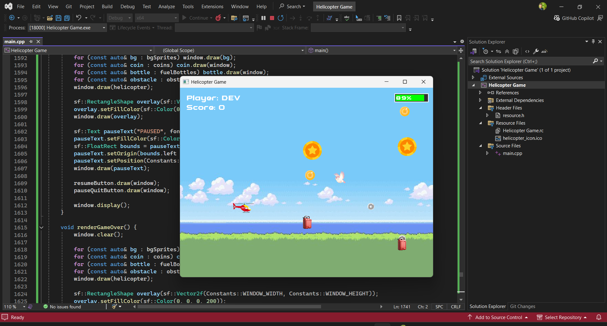

# 🚁 Helicopter Game 

A 2D side-scrolling helicopter arcade game built with SFML (Simple and Fast Multimedia Library) in C++.

## 📌 Table of Contents
- [Features](#-features)
- [Installation](#-installation)
- [Controls](#-controls)
- [Gameplay](#%EF%B8%8F-gameplay)
- [Contributing](#-contributing)
- [License](#-license)
- [Credits](#-credits)

## ✨ Features
✔️ Smooth helicopter physics with gravity and acceleration  
✔️ Three difficulty levels (Easy, Medium, Hard)  
✔️ Collectible coins (5, 10, 50 points)  
✔️ Fuel management system  
✔️ Randomly generated obstacles (birds, trees)  
✔️ Persistent high score system  
✔️ Multiple game states (menu, gameplay, pause, etc.)  
✔️ Sound effects and background music  

## 📥 Installation
### Windows (Pre-built Binary)
1. Download the latest release from [Releases](https://github.com/devutmani/HelicopterGame/releases)
2. Extract the ZIP file
3. Run `HelicopterGame.exe`

## 🎮 Controls

|       Input      |        Action       |
|------------------|---------------------|
|   ↑ (Up Arrow)   |        Ascend       |
|    Mouse Click   | Select menu options |
|        ESC       |      Pause game     |
|       SPACE      |      Start game     |
|       ALT+F4     |       Quit game     |

## 🕹️ Gameplay

## 🤝 Contributing
1. Fork the repository [This Repository](https://github.com/devutmani/HelicopterGame)
2. Create a new branch
3. Commit your changes
4. Push to the branch
5. Open a Pull Request

## 📜 License
MIT License

Copyright (c) 2023 Dev Kumar

Permission is hereby granted, free of charge, to any person obtaining a copy
of this software and associated documentation files (the "Software"), to deal
in the Software without restriction, including without limitation the rights
to use, copy, modify, merge, publish, distribute, sublicense, and/or sell
copies of the Software, and to permit persons to whom the Software is
furnished to do so, subject to the following conditions:

The above copyright notice and this permission notice shall be included in all
copies or substantial portions of the Software.

THE SOFTWARE IS PROVIDED "AS IS", WITHOUT WARRANTY OF ANY KIND, EXPRESS OR
IMPLIED, INCLUDING BUT NOT LIMITED TO THE WARRANTIES OF MERCHANTABILITY,
FITNESS FOR A PARTICULAR PURPOSE AND NONINFRINGEMENT. IN NO EVENT SHALL THE
AUTHORS OR COPYRIGHT HOLDERS BE LIABLE FOR ANY CLAIM, DAMAGES OR OTHER
LIABILITY, WHETHER IN AN ACTION OF CONTRACT, TORT OR OTHERWISE, ARISING FROM,
OUT OF OR IN CONNECTION WITH THE SOFTWARE OR THE USE OR OTHER DEALINGS IN THE
SOFTWARE.

## 👏 Credits
### Development Team
- [Dev Kumar](https://github.com/devutmani) - Lead Developer
- [Masoom Khan](https://github.com/masoomkhan) - Game Designer

### Assets
- Font: [Bruce](https://www.1001fonts.com/bruce-forever-font.html)
- Sound Effects: [Mixkit](https://mixkit.co/free-sound-effects/helicopter/)
- Music: [pixabay](https://pixabay.com/sound-effects/search/helicopter/)

### Technologies
- [SFML](https://www.sfml-dev.org) - Multimedia library
- [GitHub](https://github.com) - Version control
- [C++ MinGw](https://sourceforge.net/projects/mingw/) - Programming Language
